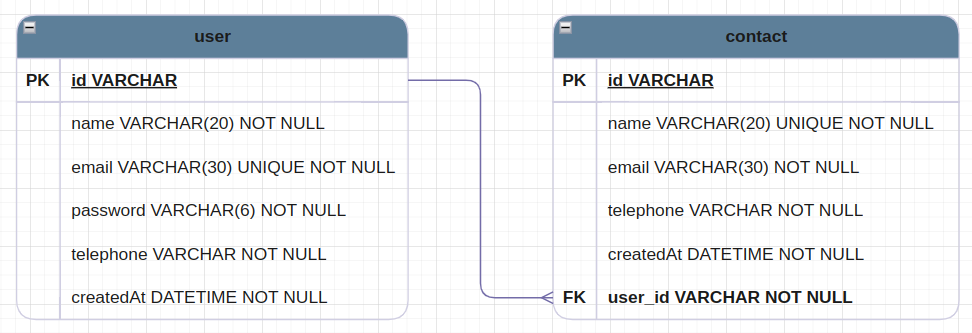

# Agenda Virtual

## Tabela de Conteúdos

- [Visão Geral](#1-visão-geral)
- [Diagrama ER](#2-diagrama-er)
- [Início Rápido](#3-início-rápido)
  - [Instalando dependências](#31-instalando-dependências)
  - [Variáveis de ambiente](#32-variáveis-de-ambiente)
  - [Migrations](#33-migrations)
  - [Rodando a aplicação](#34-rodando-a-aplicação)
- [Endpoints](#4-endpoints)

---

## 1. Visão Geral

[ Voltar para o topo ](#tabela-de-conteúdos)

Trata-se de uma api que gerencia contatos de um usuário, sendo possível fazer o cadastro com nome, email e telefone. Possui um CRUD para os contatos e também para o usuário, além de autenticação. As tecnologias utilizadas foram:

- [NodeJS](https://nodejs.org/en/)
- [Nest](https://nestjs.com/)
- [TypeScript](https://www.typescriptlang.org/)
- [PostgreSQL](https://www.postgresql.org/)
- [Prisma](https://www.prisma.io/)

A URL base da aplicação: http://localhost:3000

---

## 2. Diagrama ER

[ Voltar para o topo ](#tabela-de-conteúdos)

Diagrama ER da API definindo as relações entre as tabelas do banco de dados.



---

## 3. Início Rápido

[ Voltar para o topo ](#tabela-de-conteúdos)

### 3.1. Instalando Dependências

Clone o projeto em sua máquina e instale as dependências com o comando:

```shell
npm install
```

### 3.2. Variáveis de Ambiente

Em seguida, crie um arquivo **.env**, copiando o formato do arquivo **.env.example**:

```
cp .env.example .env
```

Configure suas variáveis de ambiente com suas credenciais do Postgres, uma nova database da sua escolha e a chave-secreta.

### 3.3. Migrations

Execute as migrations com o comando:

```
npx prisma migrate dev
```

### 3.4 Rodando a aplicação

Para rodar a aplicação, utilize o comando:

```
npm run start:dev
```

---

## 4. Endpoints

[ Voltar para o topo ](#tabela-de-conteúdos)

Para acessar os endpoints, rode a aplicação e acesse em seu navegador: http://localhost:3000/api
